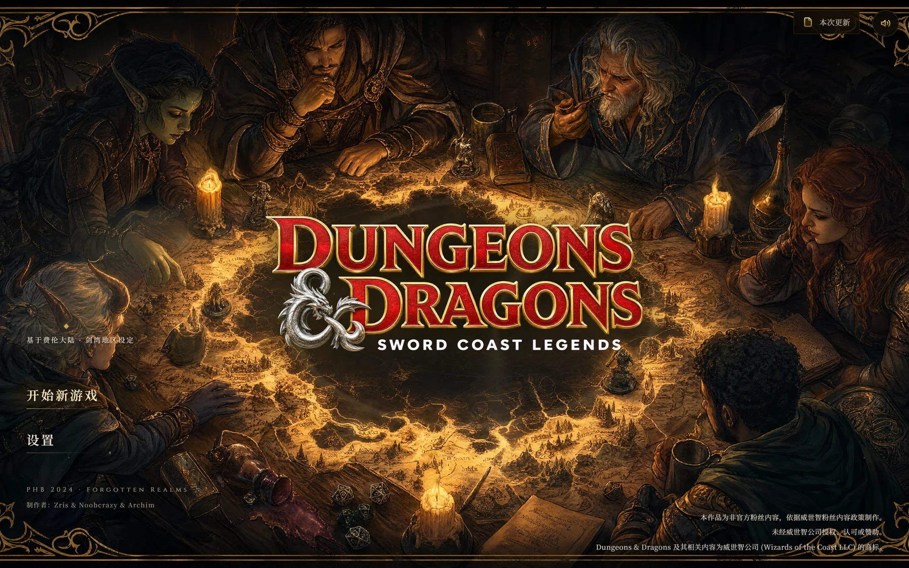
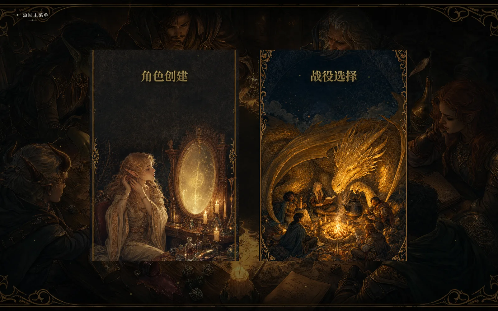
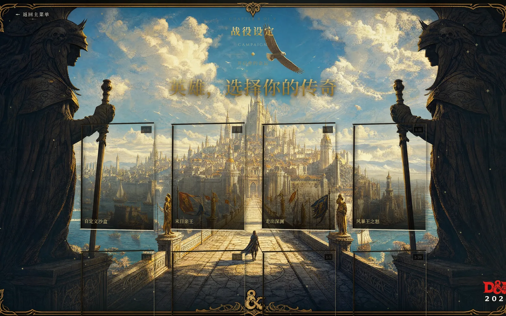
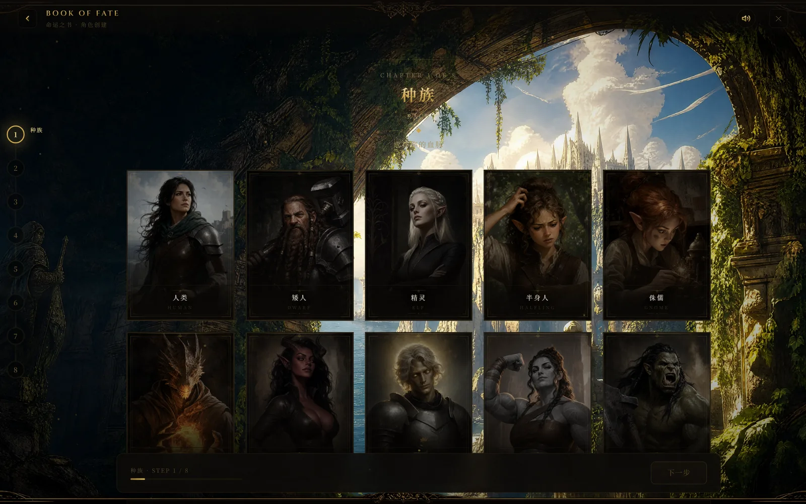
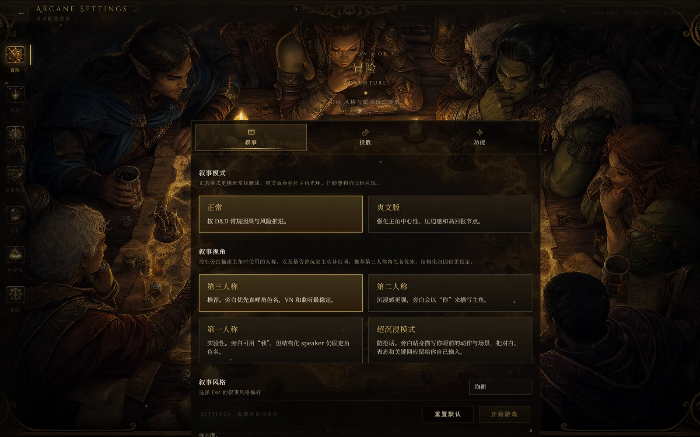

# ⚔️ 剑湾历险记 · Sword Coast Legends

### 🐉 一个人的跑团桌，AI 当你的地下城主

在浏览器里开一场属于你自己的龙与地下城。 
AI 即时编排剧情、对话与遭遇，规则由引擎严格判定——**它讲故事，引擎判规则**。

*基于费伦大陆 · 剑湾地区设定 · PHB 2024 · Forgotten Realms*

 

### **[▶ 立即游玩 · www.dnd2024.com](https://www.dnd2024.com)**

[核心玩法](#-核心玩法) · [画面一览](#-画面一览) · [游戏内容](#-游戏内容) · [如何开始](#-如何开始游玩)

 

 

## 🎲 这是什么

想象一款 CRPG，但**没有预设剧本**——每一次任务、每一段对话、每一场遭遇，都由 AI 地下城主为你即时生成；而所有涉及输赢的判定（攻击、检定、借机攻击、法术、专注、加速减速……）都由游戏引擎按 **D&D 2024** 规则严格结算。

你不是在和聊天机器人闲聊，你是在**真正地跑一场团**：

- 🧙 **你说了算**：用自己的话描述行动，或点击「建议行动」推进剧情，像被真人 DM 带团一样。
- 📖 **每局都是新故事**：战役框架取自经典模组，具体的遭遇、NPC 与转折由 AI 现场编排，没有两局相同。
- ⚔️ **规则不糊弄**：战斗 2.0 全面本地权威——胜负不靠 AI「凭感觉」，该触发借机攻击就触发，该断专注就断。
- 💾 **随开随玩**：全部在你的浏览器本地运行，进度自动保存，不用注册、不用下载。

 

## ✨ 核心玩法

| | |
|---|---|
| 🎬 **视觉小说式叙事** | 剧情自动分镜呈现，配头像、对话、旁白与骰点结果，读起来像一部会响应你的互动小说 |
| 🧬 **命运之书 · 8 章角色创建** | 种族 → 背景 → 职业 → 属性 → 出身 → 个性 → 阵营 → 总结，一步步捏出属于你的主角 |
| 🗺️ **16 部经典战役** | 从费伦大陆的传奇模组中选择，带推荐等级、故事背景与开场钩子，选好即出发 |
| ⚔️ **战斗 2.0 · 本地权威** | PHB2024 十二职业与子职业、专长、武器精通、法术射程、专注、光环、地形与借机攻击全部真实结算 |
| 🎭 **DM 风格随你调** | 叙事模式（正常 / 爽文版）、叙事视角（第一 / 二 / 三人称 / 超沉浸）、投骰风格（真实跑团 / BG3 / 嵌入式）任你搭配 |
| 🏕️ **营地 · 记忆 · 世界回响** | 短休长休、队友社交、记忆中心沉淀经历，世界以环境、压力与余波回应你的每个选择 |
| 🎨 **AI 立绘** | 主角、队友与关键 NPC 可生成专属画像，让你的队伍有脸有名 |
| 📜 **任务与传闻日志** | 进行中 / 已完成的目标随剧情实时推进，随时回看你追的每一条线索 |

 

## 🖼 画面一览

<table>
  <tr>
    <td width="50%" align="center">
       
      <b>翻开命运之书</b> · 创建角色，或选择你的传奇
    </td>
    <td width="50%" align="center">
       
      <b>英雄，选择你的传奇</b> · 16 部费伦经典战役
    </td>
  </tr>
  <tr>
    <td width="50%" align="center">
       
      <b>命运之书 · 种族</b> · 8 章捏出你的主角
    </td>
    <td width="50%" align="center">
       
      <b>奥术配置殿堂</b> · 亲手调教你的地下城主
    </td>
  </tr>
</table>

 

## 📚 游戏内容

- **⚔️ 16 部经典战役**：毁灭亲王、逃离深渊、风暴君王之雷霆、哈欠之门传奇、湮灭之墓、深水城：龙金劫 / 疯法师的地下城、冰塔峰之龙、博德之门：坠入阿弗纳斯、冰风谷：冰霜少女的雾凇、烛堡秘辛、风骸岛之龙、巨龙僭政、破碎的方尖碑、维克那：毁灭前夕……外加**自定义沙盒**，覆盖 1 级到 20 级史诗。
- **🧝 10 个可选种族**：人类、精灵、矮人、半身人、侏儒、龙裔、提夫林、阿斯莫人、巨人裔、半兽人——各具血脉特性。
- **🛡️ PHB 2024 十二职业**：完整职业与子职业特性、专长、武器精通全部机械化落地，不是纸面文字。
- **🔮 法术与战术**：法术卷轴（制作 / 使用 / 抄录 / 掉落）、召唤子系统、临时与即兴武器、法术射程门、专注、光环 tick……在战斗中真实生效。
- **🌍 会呼吸的世界**：NPC、队友社交、声望、商店、世界书与世界脉冲，共同构成一个会记住你、也会回应你的剑湾。

 

## 🚀 如何开始游玩

1. 打开 **[www.dnd2024.com](https://www.dnd2024.com)**。
2. 首次进入先到**设置页**，填入一个可用的 AI 模型（推荐 **Gemini 官方**或 **OpenAI 兼容**接口的 Key）——这是 AI 地下城主的「大脑」。
3. 回到主菜单，点「**开始新游戏**」，先翻开命运之书创建主角，再选择一场战役。
4. 确认出征，进入游戏，开始属于你的剑湾历险。

> 💡 你的 API Key 与存档都只保存在你自己的浏览器本地，不会上传。

 

## 👥 适合谁

- 想随时开一场单人 D&D、又凑不齐队友的玩家。
- 喜欢 CRPG 与互动小说、想要「无限剧本」体验的人。
- 想看看「AI 当 DM、引擎判规则」到底能玩成什么样的好奇者。

 

## 📜 备注

本作品为**非官方粉丝内容**，依据威世智粉丝内容政策制作，未经威世智公司授权、认可或赞助。Dungeons & Dragons 及其相关内容为威世智公司 (Wizards of the Coast LLC) 的商标，版权归各自权利人所有，仅供学习与非商业演示使用。

 
制作者：Zris & Noobcrazy & Archim · 用 ❤️ 与 🎲 打造 · 愿你的骰子总是暴击

